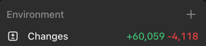

# Full working-tree changelog

Baseline: `release/1.7.0` at `a782df2`.

The work is currently uncommitted and consists of:

- 93 modified tracked files.
- 47 new Dart implementation files.
- 4 new iOS source/localization files.
- 81 new Flutter test files and 2 modified Flutter test files.
- One generated untracked coverage report.

Scope note: all implementation and validation work is confined to
`Strnadi-Mobile-App`. No files in `Strnadi-Web` were changed.

## Recording capture and audio integrity

Files include [streamRec.dart](/Users/jandrobilek/wkspaces/Strnadi-Mobile-App/lib/recording/streamRec.dart), [raw_pcm_capture.dart](/Users/jandrobilek/wkspaces/Strnadi-Mobile-App/lib/recording/raw_pcm_capture.dart), and [waw.dart](/Users/jandrobilek/wkspaces/Strnadi-Mobile-App/lib/recording/waw.dart).

- Replaced native-container file assumptions with `AudioRecorder.startStream()` and Dart-controlled raw PCM capture.
- Added serialized PCM writes and an explicit drain barrier before finalization.
- Added bounded drain and abort timeouts so stuck native streams cannot hang recording indefinitely.
- Detects and rejects unexpected WAV, CAF, and AIFF data where raw PCM is required.
- Reserves recording paths exclusively and skips existing paths, preventing timestamp collisions from truncating audio.
- Pause now completely finalizes the current segment; resume begins a new raw segment.
- Late native `STOP` events can no longer override a logical paused state.
- Raw files are deleted only after both WAV finalization and durable metadata persistence succeed.
- Partial startup, pause, resume, finish, discard, and shutdown paths now clean up recorder, location, wakelock, foreground-task, and stream resources deterministically.
- Ambiguous persistence preserves audio and blocks unsafe repeated finish attempts.
- Recorder shutdown is single-flight and stops runtime resources before disposing the native recorder.
- Recording accepts only usable foreground location permissions and no longer loops on `deniedForever`.
- Recording requires a valid starting location; an unavailable ending location falls back to the segment’s starting coordinates.

WAV handling now:

- Parses RIFF chunks instead of assuming a fixed 44-byte header.
- Validates PCM format, channel count, sample rate, byte rate, block alignment, bit depth, chunk bounds, padding, and complete frames.
- Rejects truncated, corrupt, non-PCM, or mutually incompatible segments.
- Handles odd-sized RIFF payload padding correctly.
- Concatenates segment data with bounded memory rather than loading entire recordings.
- Prevents output paths from aliasing any input path.
- Deletes partial output on failure while preserving source segments.

## Durable recorder-to-form handoff

Files include [recording_draft_handoff.dart](/Users/jandrobilek/wkspaces/Strnadi-Mobile-App/lib/PostRecordingForm/recording_draft_handoff.dart) and [draft_persistence_reconciliation.dart](/Users/jandrobilek/wkspaces/Strnadi-Mobile-App/lib/database/draft_persistence_reconciliation.dart).

- Parent recording and all parts are committed atomically before opening the metadata form.
- New captures are persisted with `captureReviewed = false`.
- The handoff validates aggregate paths, counts, durations, timestamps, coordinates, parent relationships, positive IDs, unique file paths, and unique durable upload keys.
- Ownership is captured as one immutable snapshot:
    - Authenticated user ID, email, logical session ID, environment, and host; or
    - An explicit guest owner.
- Partial or changing authentication state fails closed.
- Ownership is rechecked before, inside, and after persistence.
- If persistence throws after a possible commit, the repository reconciles the exact parent and child set using durable upload keys.
- Reconciliation accepts an ambiguous commit only when exactly one matching parent and the exact expected children exist.
- Audio is retained whenever commit state cannot be conclusively determined.
- Navigation failure after persistence leaves the recording safely recoverable.
- Unreviewed drafts appear in Local recordings and can reopen the form after their persisted aggregate and files are revalidated.
- Recovery rejects drafts that were already reviewed, uploaded, leased, assigned backend IDs, or had upload attempts.

## Post-recording form

Files include [RecordingForm.dart](/Users/jandrobilek/wkspaces/Strnadi-Mobile-App/lib/PostRecordingForm/RecordingForm.dart), [recording_form_rendering.dart](/Users/jandrobilek/wkspaces/Strnadi-Mobile-App/lib/PostRecordingForm/recording_form_rendering.dart), and [imageUpload.dart](/Users/jandrobilek/wkspaces/Strnadi-Mobile-App/lib/PostRecordingForm/imageUpload.dart).

- New recorder flows receive an already-persisted `RecordingDraftHandoff`.
- Legacy callers remain supported through guarded part conversion.
- Empty or failed part conversion no longer crashes location rendering through `parts[0]`.
- Save and discard operations are single-flight.
- Recording owner comes from the atomic activated session rather than separately changing secure-storage fields.
- Owner and device information are awaited before persistence.
- Metadata and all selected dialect segments are saved atomically.
- Changes are rejected once any parent, part, or dialect upload has begun.
- A successful save marks the recording reviewed before upload scheduling.
- Offline/Wi-Fi policy restrictions save locally without starting an upload.
- Guest users retain the draft and are directed to sign in.
- Scheduling failure is distinguished from durable-save failure.
- System back, app-bar back, and discard use one consistent confirmation path.
- Discard stops playback, removes persisted rows through the repository, and deletes only media proven to be safely owned.
- Ambiguous persistence retains media.
- Audio-player subscriptions are cancelled and mounted-guarded.
- Dialect offsets now use fractional seconds correctly; the old conversion placed intervals roughly 1,000× too early.
- All selected dialect intervals are persisted instead of only the first.
- Manual dialect notes are appended in a structured recording-note block.
- Bird-count text uses translation keys instead of embedded Czech copy.
- Photo picking now blocks rapid duplicate launches, ignores disposed-widget responses, supports injected fake pickers, guards invalid removal indexes, and publishes immutable file lists.

## Aggregate recording upload service

The central implementation is [recording_upload_service.dart](/Users/jandrobilek/wkspaces/Strnadi-Mobile-App/lib/database/recording_upload_service.dart).

- Parent and direct-part entry points now delegate to one aggregate upload service.
- Introduced durable parent leases and child upload claims.
- Lease acquisition uses compare-and-set semantics.
- Only stale upload leases can be taken over; active deletion leases remain protected.
- Acquiring a recording clears orphaned child `sending` flags left by crashed workers.
- Leases are renewed during long operations and once more before completion.
- Release clears only the caller’s transient ownership and cannot overwrite newer persisted state.
- Ambiguous lease acquisition performs safe cleanup because acquisition may have committed.
- Reserved `delete:` lease IDs cannot be used by upload workers.

Each upload freezes:

- User ID.
- Owner email.
- Access token.
- Logical login/session ID.
- Environment.
- Backend host.
- Optional device token.

Session safety:

- Missing optional device metadata cannot block an otherwise valid upload.
- Missing local owner fields may be claimed once while holding the lease.
- Existing owner, account, environment, email, or host mismatches fail closed.
- Session currency is rechecked after persistence, after file staging, before every HTTP leg, and before aggregate completion.
- Logout, account switch, new logical login, or environment switch stops further network activity.

Validation now covers:

- Positive parent and part IDs.
- Expected part count.
- Parent ownership.
- Unique local IDs, backend IDs, and durable upload keys.
- Complete and ordered time ranges.
- Finite legal GPS coordinates.
- Valid local paths and files.
- Backend-parent associations.
- Frozen request metadata.

Upload behavior:

- Every required file is preflighted before the remote parent is created.
- Expected part count and device ID are frozen before the first parent POST.
- Remote parent ID is saved before any part begins.
- Part attempt markers are persisted before bytes are sent.
- Backend part IDs are persisted immediately after success.
- Successful earlier parts survive a later part failure.
- Retries resume from durable state rather than restarting the aggregate.
- `200` reconciliation can mark an ambiguous part sent without needing its local file.
- `404` clears a stale remote part identity and permits replacement upload.
- Other reconciliation failures retain the ambiguous identity.
- Parent `sent` becomes true only after parts are reloaded and the persisted aggregate proves completion transactionally.
- Stale optimistic `sent` flags are repaired.
- Progress callbacks are observational; UI callback exceptions cannot fail an upload.
- Backend IDs accept positive integral nested/string/JSON values and reject malformed, zero, negative, or fractional results.
- Retry classification distinguishes validation and permanent 4xx failures from timeouts, conflicts, throttling, server failures, transport failures, session changes, plugin errors, and persistence failures.

Stable idempotency keys now use durable identities:

- `recording:<recording-key>`
- `recording-part:<part-key>`
- `recording-dialect:<recording-key>:<dialect-key>`

## Immutable file snapshots and multipart safety

Files include [immutable_upload_file.dart](/Users/jandrobilek/wkspaces/Strnadi-Mobile-App/lib/api/immutable_upload_file.dart) and [recording_parts_controller.dart](/Users/jandrobilek/wkspaces/Strnadi-Mobile-App/lib/api/controllers/recording_parts_controller.dart).

- Each part is validated as a playable PCM WAV before upload.
- SHA-256 and byte length are calculated and persisted under the aggregate lease.
- File size and modification metadata are checked before and after hashing.
- Previously frozen fingerprints must match on every retry.
- Files are checked again immediately before upload.
- The source is copied into a private immutable staging directory.
- Source identity is checked before and after the streamed copy.
- The staged digest and byte count are independently verified.
- Upload owns an already-open staged handle, preventing replacement of the original path from changing redirect bytes.
- Reads use bounded 64 KiB chunks.
- Redirect replay opens a fresh stream from the same immutable snapshot.
- Stale crash stages older than 24 hours are cleaned on a bounded best-effort basis.
- Partial staging failures clean their private directory.
- Cleanup/reporting failure never hides the primary transport/validation error or a successful backend response containing a durable ID.

## Redirect and API-controller hardening

Files include [post_json_with_redirect.dart](/Users/jandrobilek/wkspaces/Strnadi-Mobile-App/lib/api/post_json_with_redirect.dart) and controllers under `lib/api/controllers/`.

- Automatic authenticated redirects are disabled.
- Upload URLs must use HTTPS.
- Only one same-origin `307` or `308` redirect is replayed.
- `301`, `302`, `303`, missing or malformed locations, HTTP targets, cross-origin targets, and redirect loops are rejected.
- Relative same-origin redirects remain supported.
- JSON requests recreate identical body and headers.
- Multipart requests rebuild `FormData` with the immutable snapshot.
- Session validation runs before both the initial POST and redirect replay.
- Controllers accept captured host and access token rather than rereading mutable globals mid-request.
- Authorization is never forwarded automatically through reconciliation/download redirects.
- Expected 4xx responses are exposed to service-level reconciliation and retry policy.
- API error logging no longer emits raw Dio messages or potentially sensitive response content.

Affected controllers include:

- Authentication/account-provider checks.
- User profile reads, updates, deletion, and photo upload.
- Device registration/update/deletion.
- Recording create/update/delete/list/incomplete fetch.
- Recording-part reconciliation, upload, and download.
- Filtered recording/dialect creation.

## Background upload and dialect workflow

Files include [background_recording_upload_task.dart](/Users/jandrobilek/wkspaces/Strnadi-Mobile-App/lib/database/background_recording_upload_task.dart), [recording_upload_scheduling.dart](/Users/jandrobilek/wkspaces/Strnadi-Mobile-App/lib/database/recording_upload_scheduling.dart), and [callback_dispatcher.dart](/Users/jandrobilek/wkspaces/Strnadi-Mobile-App/lib/callback_dispatcher.dart).

- Only positive local IDs with persisted `captureReviewed = true` can be scheduled.
- Background orchestration is dependency-injected and independently testable from SQLite, Dio, Workmanager, and notification plugins.
- Interrupted upload state is reconciled before a new attempt.
- The task distinguishes invalid input, DB failure, missing row, busy upload, retryable failure, permanent failure, and success.
- Health-port registration is scoped per recording.
- Notification, health-server, and localization errors are ancillary and cannot replace the causal upload result.
- Essential configuration still fails closed.
- Background localization reloads current preferences with English fallback.
- Dialect work starts only while holding a parent workflow lease.
- Dialect upload requires a durably completed parent and the expected backend parent ID.
- Dialect request data, durable key, attempt marker, and returned backend ID are persisted safely.
- Dialect retries do not re-upload parent audio or already-completed dialects.

## Local recording actions

Files include [recording_send_coordinator.dart](/Users/jandrobilek/wkspaces/Strnadi-Mobile-App/lib/localRecordings/recording_send_coordinator.dart), `recList.dart`, `recListItem.dart`, `editRecording.dart`, and `incomplete_upload_prompt.dart`.

- Detail-page send is single-flight from incomplete-upload lookup through scheduling.
- Bulk send is single-flight.
- Bulk send skips unreviewed drafts, completed recordings, active parent leases, and active part uploads.
- Controls now use complete durable upload state rather than only a possibly stale `sending` Boolean.
- Scheduling failure resets optimistic UI state only if no worker acquired a lease meanwhile.
- Unreviewed recordings display “finish recording details” instead of send/resend.
- Incomplete-upload discovery is pinned to account and environment.
- Delayed prompt actions revalidate the captured identity.
- Local and backend incomplete states are combined.
- Retry eligibility distinguishes missing local media, ambiguous backend IDs, backend-confirmed missing parts, busy parts, and completed parts.
- Ambiguous IDs are retained for reconciliation rather than cleared optimistically.
- Orphan part rows cannot bypass aggregate validation.
- Bulk retries attempt every eligible recording and report per-record failures and unavailable media.

### Incomplete-upload status and repair

- Fixed the contradictory warning that could say the online map had received
  `1 z 1` audio parts while still claiming that audio was missing.
- The mobile client now parses the actual incomplete-recording response shape:
  positive recording IDs in a JSON list, including numeric-string IDs.
- Successful `200 []` and `204 No Content` responses are authoritative complete
  scans. Transport errors, non-success statuses, null bodies, and malformed
  successful bodies remain unavailable and cannot hide a local warning.
- A backend recording omitted from an authoritative scan is treated as
  complete even when its local sent flags are stale.
- Exact numeric warning text is shown only when the backend supplies trustworthy
  counts and proves `uploaded < expected`; ID-only or uncertain results use
  neutral wording and can never render `X z X`.
- ID-only incomplete results reconcile every safe idle local part through the
  aggregate upload service. Existing backend part IDs are checked before any
  replacement upload, so retries do not blindly duplicate audio.
- Backend part existence is now checked through the real
  `GET /recordings/{id}?parts=true` endpoint. The former mobile-only
  `/recordings/part/{recordingId}/{partId}` URL did not exist in Strnadi-API and
  could turn a valid remote part into a false `404`.
- Reconciliation validates the returned parent ID and every part ID/parent
  association before deciding that a part is absent. Malformed, mismatched,
  foreign, or duplicate data fails closed and retains the durable backend part
  ID instead of risking a duplicate upload.
- Legacy sound recovery now points to the actual
  `/recordings/part/{recordingId}/{partId}/sound` route.
- Retry is disabled when the number of local part rows does not equal the
  expected aggregate size, avoiding an upload attempt that aggregate validation
  would necessarily reject.

Metadata editing:

- Stages changes separately from the shared model.
- Reloads upload-owned fields before saving.
- Uses field-scoped updates so stale UI cannot overwrite backend IDs, sent state, owner, path, lease, or durable keys.
- Refuses changes after a lease becomes active.
- Separates local-save failure from “saved locally, backend sync failed.”
- Backend PATCH uses a captured workflow session.

Deletion:

- Acquires a reserved `delete:` lease before remote or local deletion.
- Cannot overlap an active upload.
- Only stale deletion leases can be taken over.
- Deletes partial remote parents as well as fully sent recordings.
- Treats remote `404` as already deleted.
- Revalidates deletion ownership before mutating dependent rows.
- Removes children transactionally before the parent.
- Deletes owned media after durable row deletion.
- Releases the claim after failure.

## Recording download and cache safety

New files include [recording_download_service.dart](/Users/jandrobilek/wkspaces/Strnadi-Mobile-App/lib/database/recording_download_service.dart) and [recording_cache_access.dart](/Users/jandrobilek/wkspaces/Strnadi-Mobile-App/lib/database/recording_cache_access.dart).

- Downloads use explicit local and backend identities.
- Session, owner, environment, host, and token are captured and revalidated.
- Individual parts are staged before committing cache metadata.
- Partial failures and cancellation clean staged files without removing established cache entries.
- Ambiguous local persistence is reconciled instead of being treated as conclusively failed.
- Progress-listener errors do not fail downloads.
- Cache list/delete operations are scoped to the activated account and environment.
- Guest and stale-session access fails closed.
- Duration refresh handles invalid backend data and per-record failures without poisoning other rows.
- Metadata-owned, cache-owned, and upload-owned update fields were split so stale models cannot overwrite unrelated state.

## Database schema and migrations

Database version is now **17**.

New `recordings` fields:

- `userId`
- `uploadKey`
- `uploadLease`
- `uploadLeaseUpdatedAt`
- `parentUploadAttempted`
- `uploadDeviceId`
- `captureReviewed`

New `recordingParts` fields:

- `uploadAttempted`
- `uploadKey`
- `uploadContentSha256`
- `uploadContentBytes`

New dialect fields:

- `uploadKey`
- `uploadAttempted`

New notification fields:

- `ownerUserId`
- `env`
- `providerMessageId`

Migration changes:

- Durable upload keys are backfilled for existing recordings, parts, and dialects.
- Legacy remote entities are marked attempted so editable request data cannot be reused unsafely.
- Parent links are repaired before scoped table rebuilding.
- Legacy `sending` flags without timestamped ownership are cleared.
- Existing recordings default to reviewed.
- Backend IDs are no longer globally unique:
    - Recordings are scoped by environment.
    - Parts by local recording.
    - Dialects by recording.
    - Filtered parts and detected dialects by their aggregate parent.
- Notification indexes are scoped by owner/environment and provider message ID.
- Fresh and upgraded schemas both include fingerprint fields.
- `totalSeconds` accepts any numeric SQLite value and normalizes it to `double`.
- Recording equality and hashing now use the same exact nullable metadata.
- Part readiness logs no longer expose paths, timestamps, or coordinates.

## Activated authentication sessions

The new [activated_auth_session.dart](/Users/jandrobilek/wkspaces/Strnadi-Mobile-App/lib/auth/activated_auth_session.dart) introduces a serialized two-phase session manager.

- A valid logical session binds JWT, positive backend user ID, JWT subject, verification state, monotonic generation, and opaque session ID.
- Token replacement invalidates old state before activation.
- The final activation marker is written last.
- Capture double-reads and revalidates every field.
- Logout preserves generation, preventing logical session-ID reuse.
- Torn token/user/verified writes fail closed.
- Offline restoration requires an exact unexpired activated snapshot.
- Token refresh resolves the new token owner before activation.
- Uploads, cache access, Firebase registration, navigation, profiles, and logout now use this logical session boundary.

Additional authentication fixes:

- Password login is single-flight.
- Only explicit verification statuses are accepted.
- Malformed JWTs and invalid/non-positive user IDs fail closed.
- Startup profile payloads are parsed safely from JSON or maps.
- Canonical `firstName`/`lastName` keys are written while legacy aliases remain during migration.
- Guest-draft adoption completes before verified navigation and the session is rechecked afterward.
- Password reset rejects malformed/expired links, prevents rapid duplicate requests, ignores late responses after disposal, and localizes server/connection errors.
- Verification resend is serialized and manages cooldown timers safely.
- Registration email availability uses request generations to prevent stale responses overwriting newer input.
- Provider/auth logs no longer print credentials, emails, tokens, or response bodies.

## Firebase, FCM, and notification isolation

- Firebase initialization is now awaited and idempotent.
- Background handler registration occurs after Firebase core initialization.
- Local notification and messaging startup run deterministically and report failures independently.
- FCM registration/update is serialized and bound to one captured session, user, subject, token, environment, and host.
- Session state is checked before and after metadata reads, network requests, and marker persistence.
- Relogin, account switch, or environment change cannot mutate an old device binding.
- Corrupt local bindings cause fresh scoped registration.
- Logout cleanup remembers the binding’s original host.
- Remote deletion, Firebase token invalidation, and local marker removal are attempted independently.
- Foreground pushes independently await display and persistence.
- Background data-only messages can be localized, displayed, and persisted.
- Notification cache rows are scoped to owner and environment.
- Provider message IDs deduplicate within the same scope.
- Only normalized notification fields are persisted; unrelated sensitive payload data is discarded.
- Retention is capped at the newest 500 rows per owner/environment.
- Legacy unowned rows remain quarantined instead of being assigned to the current user.
- Unread badges refresh after inserts, mutations, and environment switches.

## Bootstrap and app lifecycle

- Database bootstrap now has four ordered phases:
    1. Open storage.
    2. Run migrations/backfills.
    3. Enforce recording limits.
    4. Reconcile interrupted uploads.
- Failure identifies the exact phase, stops later work, and is rethrown.
- A localized storage-unavailable screen allows guarded retry.
- The main app, notifications, and deep links start only after DB bootstrap succeeds.
- Update and platform-service checks moved to the mounted root application.
- Update/service checks are sequenced to prevent overlapping dialogs.
- Notification initialization is awaited.
- Environment changes refresh unread notification state.
- `MyApp` now supports an injected test home and disabled lifecycle side effects.
- `Config.isHostEnvironmentLoaded` prevents background isolates from assuming production before stored preferences load.

## Location, map, and navigation

Location:

- A shared geolocation stream exists only while active listeners are attached.
- The underlying subscription is cancelled when the final listener detaches.
- Reattachment is supported without accepting stale-generation events.
- Current-position lookup is bounded.
- Cached fallback locations must be finite, within geographic bounds, and no older than 30 seconds.
- Stale, future, invalid, or missing locations fail closed instead of defaulting to `(0,0)`.

Map:

- Async request generations reject late recordings, dialects, search, and clustering responses.
- Overlapping loading operations use independent tokens.
- Switching author clears old markers immediately.
- Invalid current-user IDs fail closed.
- Disposing the map invalidates outstanding work.
- Search queries use structured URIs and validate response shapes and coordinates.
- Recording details retain and cancel audio subscriptions correctly.
- Part/location access is null-safe.
- Reverse-geocoding credentials and local paths are no longer logged.

Navigation:

- Added a centralized recorder exit policy.
- Bottom tabs, Guide, notifications, and guest-login flows must receive recorder cleanup approval before leaving.
- Cancelled or failed cleanup keeps the recorder open.
- Offline map availability is checked before destructive recorder cleanup.
- Tapping the selected recorder tab is a no-op.
- Guest preference-write failure cannot strand navigation after successful cleanup.
- Async navigation now uses mounted/context guards.

## User, profile, settings, and logout

- Profile payloads and postal codes are parsed without throwing.
- Profile API calls use captured token and host and refuse automatic redirects.
- Profile responses are discarded after account or environment changes.
- Profile save is single-flight with loading/saving states.
- Controllers are disposed correctly.
- Profile photos:
    - Are capped at 8 MiB.
    - Are read once.
    - Are published only after backend acceptance.
    - Use cache keys scoped by owner and environment.
    - Preserve the old visible photo after upload, cache, or session failure.
- Connected Apple/Google account checks use one captured verified session.
- Only explicit connected/disconnected statuses are accepted.
- Errors are distinct from “not connected.”
- Stale provider responses are dropped.
- Connection buttons are serialized and localized.
- Logout strictly awaits analytics capture, identity reset, scoped FCM cleanup, logical-session invalidation, and provider sign-out.
- Settings persistence and language changes are awaited.
- Cached recording deletion is owner/environment scoped.
- Environment changes await logout.
- Achievements handle empty lists without division by zero and avoid concurrent state updates.

## Update checker, security, and logging

Update checker:

- Android now uses Google Play Core instead of scraping Play Store HTML.
- Added native channel `com.delta.strnadi/app_update`.
- Android compares Play update availability and version code.
- iOS parses iTunes results defensively.
- Only trusted Apple HTTPS store URLs are accepted.
- iOS now opens the returned App Store URL instead of incorrectly redirecting to Google Play.
- Dialog presentation and service checks cannot overlap.
- Late checks stop after unmount.
- Store-launch failure still closes the dialog safely.

Protected Markdown downloads:

- Bearer authorization is sent only to the exact configured HTTPS backend authority.
- HTTP, subdomains, userinfo tricks, altered ports, and redirects are rejected.
- The verified activated session is checked before, during, and after streaming.
- Downloads are capped at 100 MiB.
- Protected files use exclusive random temporary paths.
- Protected bytes and tokens are never placed in the shared cache.
- Partial files are cleaned after failure.

Logging:

- Deep-link query/reset-token data is redacted.
- Raw API error messages and response bodies were removed.
- Auth, profile, achievement, recording, location, map, and FCM logs now emit status-level metadata rather than sensitive content.
- Recording-part readiness logs no longer expose file paths or coordinates.

## Native platform changes

Android:

- Added `com.google.android.play:app-update:2.1.0`.
- Added the Play update method channel and explicit error handling.
- Renamed the original audio-channel constant for clarity.

iOS:

- Removed the cold-start universal-link early return that could skip Flutter/plugin initialization.
- Flutter and Workmanager setup now completes before forwarding the link.
- Added [ColdStartLinkForwarder.swift](/Users/jandrobilek/wkspaces/Strnadi-Mobile-App/ios/Runner/ColdStartLinkForwarder.swift) and native tests for URL/nil behavior.
- Removed `FirebaseAppDelegateProxyEnabled = false`, restoring normal Firebase delegate handling.
- Removed all ATS exception domains, including insecure HTTP access.
- Added localized permission descriptions for English, Czech, and German.
- Registered localized `InfoPlist.strings` and Czech/German regions in the Xcode project.

## Localization and general UI

All Czech, English, and German translation files now have matching structures.

Added or repaired strings for:

- Database bootstrap and retry.
- Upload success/failure/recovery.
- Missing recordings and DB errors.
- Review-required drafts.
- Form save/schedule/login/invalid-part failures.
- Segment finalization and ambiguous recording saves.
- Password reset and email verification.
- Connected Apple/Google accounts.
- Profile photos.
- Updates.
- Maintenance and server health.
- Achievements.
- Google Play services and startup permissions.
- Guest recording behavior.
- Edit/save synchronization failures.

Additional fixes:

- Health and maintenance screens no longer contain hard-coded Czech/English copy.
- Achievements handle zero items.
- Various async UI calls gained `mounted` checks.
- Removed unused imports, helpers, variables, and raw `print` calls.
- `crypto ^3.0.7` is now a direct dependency for upload fingerprints.

## Reported notification, dialect, and recording-detail fixes

Foreground recording notification:

- Android now declares the recording foreground service with
  `android:stopWithTask="true"`, so dismissing the app task cannot leave the
  paused-recording notification alive.
- Foreground-task boot restart is explicitly disabled.
- Cold app startup and recorder entry both reconcile and stop an orphaned
  recording service left by an older app version or interrupted shutdown.
- Service stop is awaited, retried, and verified instead of treating a plugin
  request as proof that the notification disappeared.
- Start, pause, resume, finish, discard, navigation cleanup, and widget disposal
  share the same checked service boundary.
- A system-started task handler immediately self-terminates because audio capture
  cannot validly resume after process death.
- If cleanup genuinely fails, discard preserves the recording and shows
  localized recovery guidance instead of deleting the only recoverable copy.

Recording notes:

- Recording-detail notes no longer use a fixed-height horizontal row.
- Notes wrap to the available width, grow vertically, remain inside the card,
  and scroll with the detail page.
- Long prose and long unbroken tokens are covered on narrow screens by widget
  and golden tests.

Dialect summaries and map markers:

- Local recording rows now resolve their displayed dialect with explicit
  precedence: admin-confirmed, then AI-predicted, then the user's manual guess.
- Current and legacy detected-dialect rows are both supported.
- An authoritative admin `No Dialect` result suppresses lower-confidence AI and
  manual values; a real dialect at the same authoritative tier still wins.
- Model-state labels such as `Unfinished`, `Unassessed`, `Undetermined`,
  `Unusable`, `Unknown`, and `I don't know` are treated as semantic sentinels,
  never as dialect abbreviations.
- The map and recording detail use the same source-selection policy. A
  substantive admin result on any part beats an incomplete representative
  segment.
- Sentinel-only processed recordings remain visible as one neutral `Unknown`
  marker rather than being split into diagonal dialect/white artifacts. This
  preserves recordings such as recording 243 while avoiding a false dialect.
- Confirmed `No Dialect` recordings remain intentionally hidden where the
  selected map mode excludes recordings without a dialect.
- Dialect-color cache keys are scoped by environment and API host, preventing
  production colors or stale classifications from leaking into development
  after an environment switch.
- Changing environment now awaits a complete scoped palette refresh.

# Test changelog

There are 83 changed Flutter test files (81 new and 2 modified). Across the
current test tree there are 967 explicit declarations; parameterized cases
expand the executed suite to 1,173 tests.

## Recording and post-recording — 87 declarations

Covers:

- Raw PCM allocation, serialized writes, abort/drain behavior, container detection.
- WAV validation, concatenation, corruption, padding, aliasing, and cleanup.
- Recording path collisions, permissions, state reduction, and resource shutdown.
- Production recorder integration and commit-before-navigation.
- Atomic draft persistence, recovery, discard ownership, and ambiguous commits.
- Empty-part rendering and photo-picker safety.

## Upload/API/database — 396 declarations

Principal suites:

- [recording_upload_service_test.dart](/Users/jandrobilek/wkspaces/Strnadi-Mobile-App/test/database/recording_upload_service_test.dart): 130 declared tests plus parameterized cases.
- [immutable_recording_part_upload_test.dart](/Users/jandrobilek/wkspaces/Strnadi-Mobile-App/test/api/immutable_recording_part_upload_test.dart)
- `post_json_with_redirect_test.dart`
- `recording_parts_controller_test.dart`
- `recordings_controller_test.dart`
- `filtered_recordings_controller_test.dart`
- `background_recording_upload_task_test.dart`
- `background_upload_initialization_test.dart`
- `recording_upload_scheduling_test.dart`
- `upload_protocol_test.dart`
- `recording_upload_fingerprint_contract_test.dart`
- `database_adapter_contract_test.dart`
- `recording_download_service_test.dart`
- `recording_download_adapter_contract_test.dart`
- `recording_duration_refresh_test.dart`
- `recording_cache_access_test.dart`
- `recording_update_fields_test.dart`
- `recording_model_test.dart`

These cover every major failure boundary:

- Parent creation failure.
- Part failure at every ordinal.
- HTTP and transport failures.
- Persistence failure before and after possible commit.
- Missing/corrupt/mutated files.
- Invalid WAV content.
- Redirect rejection and replay.
- Session/account/environment changes at every network leg.
- Stale and competing leases.
- Heartbeat failure.
- Ambiguous remote IDs.
- Partial retry and reconciliation.
- Completion transaction failure.
- Cleanup/reporting failure.
- Concurrent sends and progress-listener exceptions.
- Real integer-ID incomplete-recording payloads, authoritative empty scans,
  malformed/failing scans, stale local completion flags, exact-count display
  invariants, ID-only reconciliation, and local-row count mismatches.

## Authentication — 53 declarations

Covers logical-session activation, torn writes, offline restoration, account switches, refresh, tamper detection, password-reset races, profile payload parsing, and production wiring contracts.

## Firebase and notifications — 115 declarations

Covers device bindings, token refresh/cleanup, account/environment changes, concurrent cleanup, initialization, foreground/background delivery, normalized persistence, retention, deduplication, and cache isolation.

## Local recording UI — 38 declarations

Principal regression suites include
`upload_integration_helpers_test.dart` (23 declarations) and
`upload_integration_contract_test.dart` (8 declarations).

Covers rapid send taps, single-flight prompts, reviewed-state scheduling, active
upload detection, incomplete-part eligibility, retries, interrupted-draft
visibility, and the invariant that an incomplete-upload dialog never reports
equal uploaded and expected counts as missing audio.

## Location/map/navigation — 60 declarations

Covers location subscription lifetimes, fallback age and bounds, map request generations, stale marker rejection, recorder exit policy, guest navigation, Guide/notification shortcuts, and session landing.

## User/update/security/localization/utilities — 111 declarations

Covers:

- Profile and connected-account account-switch races.
- Ordered logout.
- Settings persistence.
- Update parsing and dialogs.
- Exact HTTPS authority checks.
- Sensitive logging contracts.
- Translation parity and stable keys.
- Async single-flight behavior.
- Recursive log redaction.
- Isolated root widget construction.

## API and DB isolation guarantees

[upload_test_isolation_contract_test.dart](/Users/jandrobilek/wkspaces/Strnadi-Mobile-App/test/database/upload_test_isolation_contract_test.dart) enforces that upload-related tests:

- Cannot import SQLite or SQLite FFI.
- Cannot call `DatabaseNew.initDb`.
- Cannot access `DatabaseNew.database`.
- Cannot reference the production API host.
- Must use fake persistence boundaries.
- Must install fake Dio `HttpClientAdapter` implementations.
- Must use the reserved `example.test` host.
- Must provide fake upload store, API, session, policy, and file-probe implementations.

Download tests additionally require fake store, API, session, and filesystem boundaries. Source-only contracts cover production adapter wiring without opening a database.

# Verification

- Full Flutter suite: **1,173/1,173 passed**.
- Focused incomplete-upload/database/localization suite: **73/73 passed**.
- Focused part-reconciliation parser/controller/contract suite:
  **148/148 passed**.
- Existing aggregate reconciliation with fake store/API: **7/7 passed**.
- Focused recording/upload suite: **360/360 passed**.
- Upload-service coverage: **98.34%**.
- Background-upload coverage: **95.83%**.
- Immutable-upload transport coverage: **87.16%**.
- Send-coordinator coverage: **100%**.
- Overall measured coverage: **20.07%**.
- Analyzer: **0 errors, 0 warnings**, 299 non-blocking style/deprecation infos.
- iOS simulator debug build: succeeded and was installed into the booted simulator.
- Android debug APK build: succeeded.
- The packaged Android manifest contains
  `ForegroundService android:stopWithTask="true"`.
- Simulator flow exercised: permission denial/recovery, start, pause, resume, finish, and post-recording form.
- The simulator flow stopped before Save; no real upload was made.
- Upload, API, database, notification-lifecycle, dialect, and widget tests use
  fake boundaries or mocked transports; no test contacts a real API or opens
  the production SQLite database.
- `git diff --check`: passed.
- Localization JSON and iOS plist/project validation: passed.
- No temporary build/cache paths leaked into tracked source.
- Generated coverage report: `coverage/lcov.info`.
- Generated Android artifact: [app-debug.apk](/Users/jandrobilek/wkspaces/Strnadi-Mobile-App/build/app/outputs/flutter-apk/app-debug.apk).
