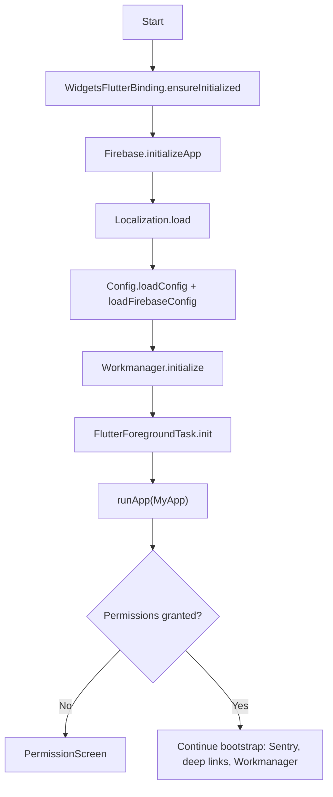

# Architecture Guide

This document highlights the moving parts of the Návrat krále client and how responsibilities are separated across packages.

## Application bootstrap
The entry point (`main.dart`) performs a guarded bootstrap that initializes Firebase, loads configuration files, and prepares background services before showing UI. A `PermissionGate` widget requests microphone and notification access before the rest of the app is allowed to run.[lib/main.dart (lines 84–175)](lib/main.dart#L84-L175)

## Navigation shell
`MyApp` builds a `MaterialApp` whose routes are split between authentication screens (`lib/auth`), the main observation UI, and background surfaces such as maintenance notices and update checks.[lib/main.dart (lines 175–320)](lib/main.dart#L175-L320) Navigation uses a global `NavigatorState` so deep-link handlers and background callbacks can push screens without a `BuildContext`.[lib/main.dart (lines 35–83)](lib/main.dart#L35-L83)[lib/deep_link_handler.dart (lines 1–120)](lib/deep_link_handler.dart#L1-L120)

## Feature domains
- **Authentication (`lib/auth/`)** – Login, registration, password reset, and token management. Access tokens are stored securely via `flutter_secure_storage` and refreshed alongside Firebase messaging tokens.[lib/auth/authorizator.dart (lines 1–160)](lib/auth/authorizator.dart#L1-L160)[lib/firebase/firebase.dart (lines 57–160)](lib/firebase/firebase.dart#L57-L160)
- **Recording (`lib/recording/`)** – Provides audio capture (with `record` and `audioplayers`), WAV export utilities, and UI flows for annotating recordings. Segments are persisted locally before uploads.[lib/recording/streamRec.dart (lines 1–200)](lib/recording/streamRec.dart#L1-L200)[lib/recording/waw.dart (lines 1–160)](lib/recording/waw.dart#L1-L160)
- **Dialect curation (`lib/dialects/`)** – Hosts the model handler, spectrogram viewer, and forms that label recordings with dialect metadata and notes.[lib/dialects/ModelHandler.dart (lines 1–160)](lib/dialects/ModelHandler.dart#L1-L160)[lib/PostRecordingForm/addDialect.dart (lines 1–160)](lib/PostRecordingForm/addDialect.dart#L1-L160)
- **Mapping (`lib/map/`)** – Fetches observations, renders map tiles with filters, and links markers back to detailed recording pages.[lib/map/mapv2.dart (lines 1–200)](lib/map/mapv2.dart#L1-L200)[lib/map/RecordingPage.dart (lines 1–160)](lib/map/RecordingPage.dart#L1-L160)
- **Data & sync (`lib/database/`)** – Manages the SQLite store, orchestrates uploads to the backend, and registers Workmanager tasks for periodic syncs and notifications.[lib/database/databaseNew.dart (lines 18–240)](lib/database/databaseNew.dart#L18-L240)[lib/callback_dispatcher.dart (lines 1–160)](lib/callback_dispatcher.dart#L1-L160)
- **Notifications (`lib/notificationPage/`)** – Displays push messages stored by the database layer and provides user controls for clearing or acting on them.[lib/notificationPage/notifList.dart (lines 1–160)](lib/notificationPage/notifList.dart#L1-L160)[lib/notificationPage/notifications.dart (lines 1–160)](lib/notificationPage/notifications.dart#L1-L160)
- **Localization (`lib/localization/`)** – Flattens nested JSON translation files and exposes a simple `t()` helper for UI copy.[lib/localization/localization.dart (lines 1–28)](lib/localization/localization.dart#L1-L28)

## Data flow
1. **Capture** – When a user starts a recording, audio samples and location updates are captured, split into logical parts, and saved to disk alongside metadata.[lib/recording/streamRec.dart (lines 1–200)](lib/recording/streamRec.dart#L1-L200)[assets/databaseScheme.sql (lines 1–22)](assets/databaseScheme.sql#L1-L22)
2. **Persist** – The database layer writes entries into the `recordings` and `recording_parts` tables defined in `assets/databaseScheme.sql`. Attachments are referenced by file path in the documents directory.[lib/database/databaseNew.dart (lines 112–240)](lib/database/databaseNew.dart#L112-L240)[assets/databaseScheme.sql (lines 1–22)](assets/databaseScheme.sql#L1-L22)
3. **Analyse** – Dialect detection runs on-device using the `ModelHandler`, enriching metadata that feeds both UI and upload payloads.[lib/dialects/ModelHandler.dart (lines 1–160)](lib/dialects/ModelHandler.dart#L1-L160)[lib/PostRecordingForm/addDialect.dart (lines 1–160)](lib/PostRecordingForm/addDialect.dart#L1-L160)
4. **Sync** – Background workers upload pending recordings, refresh notification feeds, and reconcile server-side dialect confirmations. Workmanager tasks call back into `databaseNew.dart` even when the app is not foregrounded.[lib/callback_dispatcher.dart (lines 1–160)](lib/callback_dispatcher.dart#L1-L160)[lib/database/databaseNew.dart (lines 240–400)](lib/database/databaseNew.dart#L240-L400)
5. **Visualise** – Map screens request aggregated geojson-like payloads and render markers, polylines, and overlays to visualise dialect spread. Marker taps open the full recording page with playback controls.[lib/map/mapv2.dart (lines 120–320)](lib/map/mapv2.dart#L120-L320)[lib/map/RecordingPage.dart (lines 1–160)](lib/map/RecordingPage.dart#L1-L160)

## Third-party services
- **Firebase Cloud Messaging**: `firebase.dart` registers device tokens, handles background messages, and stores notifications in the local database.[lib/firebase/firebase.dart (lines 18–160)](lib/firebase/firebase.dart#L18-L160)
- **Sentry**: `main.dart` wraps bootstrap code with `runZonedGuarded` and initialises Sentry with logging integration and session replay to capture crashes and performance metrics.[lib/main.dart (lines 29–124)](lib/main.dart#L29-L124)
- **Google Play Services**: Android clients verify Play Services availability on launch to guarantee map, location, and FCM features operate correctly.[lib/main.dart (lines 52–99)](lib/main.dart#L52-L99)

## Extending the app
- Add new domain features by creating a dedicated subdirectory in `lib/` and exposing routes through `MyApp`. Reuse shared widgets from `lib/widgets`, such as the spectrogram painter used in the post-recording review flow, to maintain UI consistency.[lib/main.dart (lines 175–320)](lib/main.dart#L175-L320)[lib/widgets/spectogram_painter.dart (lines 1–160)](lib/widgets/spectogram_painter.dart#L1-L160)
- When storing new entities, update `assets/databaseScheme.sql` and provide migration helpers in `databaseNew.dart`. Ensure uploads are resilient to offline mode by queueing operations for the Workmanager jobs.[assets/databaseScheme.sql (lines 1–22)](assets/databaseScheme.sql#L1-L22)[lib/database/databaseNew.dart (lines 240–400)](lib/database/databaseNew.dart#L240-L400)
- Remember to translate new strings and update the language JSON files consumed by the localization helper.[lib/localization/localization.dart (lines 1–28)](lib/localization/localization.dart#L1-L28)

