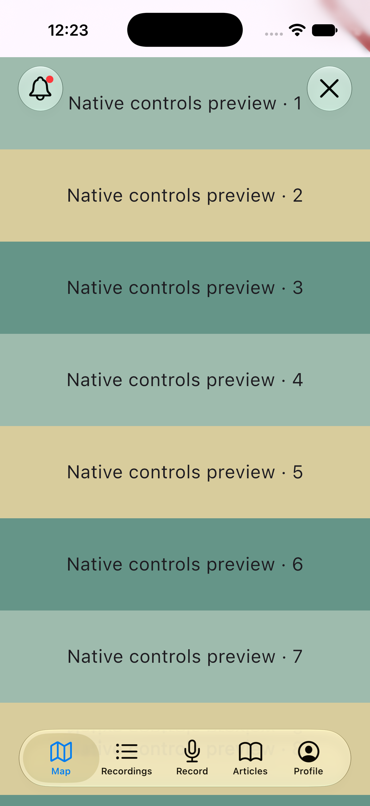

# Native iOS navigation and controls

On iOS, the shared tab bar is a real `UITabBar`, and the close/back/map/help/notification buttons are real `UIButton` views. iOS 26+ uses `UIButton.Configuration.glass()`; earlier supported iOS versions use UIKit's gray button configuration. UIKit owns the tab bar appearance on every version. Android keeps the Flutter controls.

Do not add a custom tab bar background, `UITabBarAppearance`, an opacity override, or a `UIAccessibility.isReduceTransparencyEnabled`-based imitation. Keeping the system material lets UIKit apply the user's Liquid Glass and accessibility preferences, including changes while the app remains open.

Flutter still owns navigation. Native tab actions await the existing recording-exit and guest-access checks. UIKit animates the selection gesture; a rejected action restores the committed Flutter tab. Additional native actions are ignored while a decision is pending.

Individual buttons retain a 48-point touch target, with 4 points of outer padding. App bars leave 12 points from each screen edge to the control and 8 points between adjacent actions. Map controls omit the extra outer padding because their layout already supplies the gap. Native symbols use explicit 12-point content insets.

## Isolated visual preview

```sh
flutter run -t test/manual/native_controls_preview.dart -d <ios-simulator-id>
```

This entry point does not initialize the backend, SQLite, recording, or location services. Do not distribute a build made with this preview entry point.

Check on iOS 26 or newer:

1. Tap and drag across the tab bar: verify the native floating selection, SF Symbols, and labels. Rotate the device and confirm the home indicator and controls do not overlap.
2. Change the system Liquid Glass appearance and Accessibility > Display & Text Size > Reduce Transparency. Return to the preview, then change it again while the preview remains running. The native material should follow the system. Restore the original simulator preferences afterward.
3. Check light/dark appearance, Increase Contrast, Reduce Motion, larger text, and VoiceOver labels.
4. Run the normal app and test a cancelled recording-exit confirmation, approved exit, guest login prompt, and offline map rejection. Cancellation must retain both the recording and the original selected tab. Keep device/integration QA separate from mocked tests.

Dart tests mock platform-view creation and method channels. They cover selected-index reconciliation, concurrent-action suppression, localized labels, disabled buttons, badges, and disposal while an action is pending. Flutter golden tests cover only the Flutter fallback; they cannot validate UIKit rendering.

## Validation in this change

- Simulator preview built successfully with Xcode 27.0 / iOS 27 SDK.
- Viewed the native tab bar and buttons in an iPhone 17 Pro simulator, including a live Increase Contrast change; restored the original contrast preference afterward.
- Eight mocked native bridge/layout/selection tests and fifteen glass/navigation tests passed. The padding adjustment also passed Swift type-checking and a narrow-toolbar golden check. The new components, tests, and preview entry point passed scoped static analysis without issues.
- Clear/Tinted, Reduce Transparency, drag gestures, physical-device performance, and live recording/navigation QA remain manual checks.


